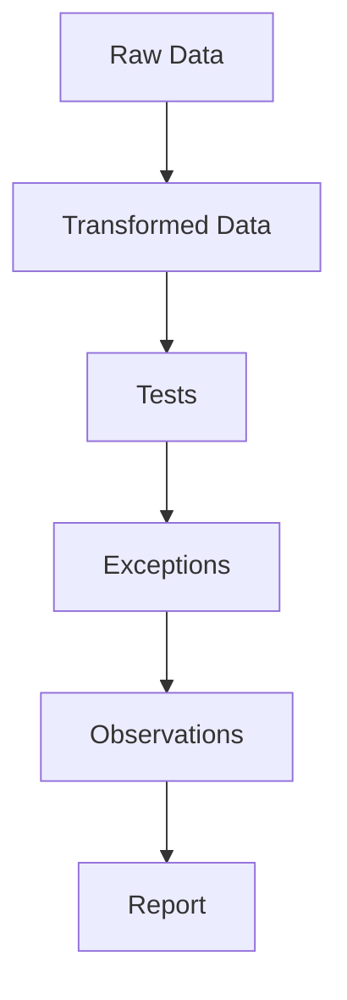

> Principles:
>>1. Raw data is evidence. Evidence should not be modified.

>>2. Notebooks/Scripts are workpapers.
One script = one test

Risk -> Control -> Test -> Script -> Result

>>3. Outputs are disposable

>>4. Data lineage

raw -> interim -> processed -> observation


---

## Why

In many audits, an auditor receives an Excel file, applies filters, removes rows, creates formulas, builds pivot tables, copies selected results into another workbook, and later uses those results in a report.

This may work for a small task, but it creates problems with bigger ones:

* the original data may be changed;
* transformation steps are hard to review;
* formulas may be overwritten;
* filters may be forgotten;
* exceptions may be difficult to reproduce;
* errors require manual rework;
* another auditor cannot easily understand how the result was obtained.

We:

> Keep raw data unchanged.
> Transform data through scripts.
> Generate outputs from reproducible logic.
> Link results to tests, observations, and reports.

---

## Raw Data Is Evidence

Evidence should not be manually modified. Files received from systems, process owners, external providers, or other sources should be stored as received.

Typical raw files:

* Excel workbooks;
* CSV exports;
* system reports;
* database extracts;
* API exports;
* screenshots;
* emails;
* signed confirmations.

The raw folder should answer one question:

> What exactly did the auditor receive?

If raw data contains errors or irrelevant records, it's ok. The correction or filtering logic should be documented in scripts.

Bad pattern:

```text
Open Excel → Delete rows → Save file → Use modified file
```

Better pattern:

```text
Save raw file → Write script → Generate cleaned dataset → Use cleaned dataset
```

---

## Scripts Are Part of the Audit Trail

A script shows:

* what data was loaded;
* which fields were used;
* what records were excluded;
* how exceptions were identified;
* how calculations were performed;
* how results were generated.

This makes the script similar to a workpaper. Anyone should be able to inspect the script and understand the logic behind the audit result.

---

## One Test, One Script

When practical, use one script for one audit test. A clear script name helps connect:

```text
Risk → Control → Test → Script → Result → Observation
```

For example:

```text
R-001 Unauthorized purchases
  ↓
C-001 Purchase order approval
  ↓
T-001 Test approval before release
  ↓
T001_po_approval_before_release.py
  ↓
po_approval_exceptions.xlsx
  ↓
O-001 Purchase orders released before approval
```

This makes the audit easier to review.

---

## Working with Excel

The issue is not Excel itself, it is manual changing of Excel files without a reproducible trail.

Recommended approach:

1. Save the received workbook in `04_evidence/02_raw_data/`.
2. Load it through a script.
3. Clean and transform data in code.
4. Export reviewable outputs if needed.
5. Link outputs to tests and observations.

---

## Working with Databases

If the audit team has direct access to a database, the same principles apply.

Recommended approach:

* document the source system;
* save SQL queries;
* avoid undocumented manual extracts;
* store query results when needed;
* make the extraction repeatable;
* document data limitations.

SQL queries are part of audit documentation when they are used to obtain evidence or produce audit results.

---

## Working with APIs

When using APIs, document:

* endpoint or source system;
* parameters used;
* extraction date where relevant;
* authentication method without exposing credentials;
* limitations or filters;
* output location.

Do not store API keys in the repository.

Recommended:

```text
.env.example
```

Not recommended:

```text
.env
api_key.txt
credentials.json
```

---

## Data Quality Checks

Before testing controls or transactions, the audit team should understand data quality.

Typical checks include:

* row count;
* missing values;
* duplicate records;
* unexpected dates;
* invalid statuses;
* negative amounts;
* records outside the audit period;
* unmatched keys between datasets;
* inconsistent identifiers;
* unusual values.

Data quality checks should be documented because they affect the reliability of audit results. Data quality issues do not always prevent audit work, but they should be considered when forming conclusions.

---

## Linking Data Results to Audit Work

Data analysis should be linked to audit procedures.

A test in `audit_program.yml` may reference a script:

```yaml
tests:
  - id: T-001
    risk_id: R-001
    control_id: C-001
    title: "Test purchase order approval before release"
    script: "04_evidence/02_raw_data/scripts/T001_po_approval_before_release.py"
    output: "04_evidence/99_generated/po_approval_exceptions.xlsx"
```

A workpaper may reference the same script and output:

```text
Procedure performed:
Ran script T001_po_approval_before_release.py to identify purchase orders released before approval.

Output:
04_evidence/99_generated/po_approval_exceptions.xlsx

Conclusion:
Exceptions were identified and discussed with management. Control is inefficient. 
```

An observation may reference the test and evidence:

```yaml
observations:
  - id: O-001
    linked_tests:
      - T-001
    evidence:
      - E-008
    condition: "148 purchase orders were released before approval."
```

This preserves the reasoning chain.

---

## Recommended Minimal Data Workflow

A simple data workflow may look like this:

```text
1. Save received file in 04_evidence/02_raw_data/
2. Profile the data
3. Write a script for the audit test
4. Generate exception list
5. Investigate exceptions
6. Document conclusion in workpaper
7. Link result to observation if needed
8. Generate report exhibit if useful
```

---
