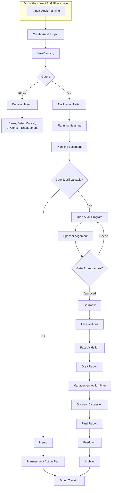
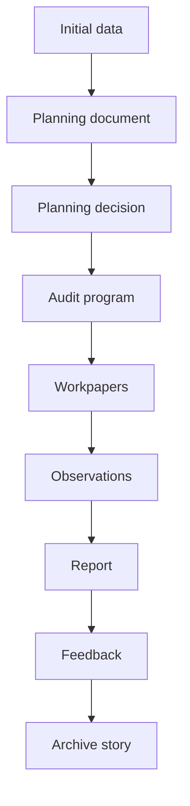

# Workflow

AuditFlow uses a decision-oriented workflow. It is not designed to force every audit through a mechanical checklist. It is designed to make key audit decisions explicit and traceable.

## Overview



## Current Artifact Flow



## Current CLI Flow

```bash
auditflow init <project>
auditflow create planning
auditflow create audit-program
auditflow create workpapers
auditflow create observations
auditflow create report
auditflow feedback request
auditflow feedback summary
auditflow create archive
```

QMD documents are previewed and rendered using the standard Quarto extension in VS Code or the `quarto preview` and `quarto render` commands. AuditFlow does not require a separate rendering workflow.

## Gate 1: Is The Audit Still Worth Doing?

Gate 1 happens during pre-planning and planning. At this point, the audit team decides whether the audit should continue in its current form.

Possible outcomes:

- continue;
- defer;
- cancel;
- convert to advisory work;
- redefine the scope.

The rationale should be documented in `01_planning/planning_document.qmd` and, if it is a significant decision, in `00_admin/decisions.yml`.

A No-Go decision may lead to a **Decision Memo**. The purpose of the Decision Memo is to document why a full audit should not proceed at this stage.

## Gate 2: What Risks Are In Scope?

Gate 2 is documented in `01_planning/planning_decision.yml`.

The audit team should decide:

- final in-scope and out-of-scope areas;
- included risks;
- excluded risks;
- key controls or explicit absence of controls;
- recommended tests.

This is the source for `auditflow create audit-program`.

The question could be:

> Would fieldwork provide meaningful additional assurance or insight?

If yes, the team prepares a draft audit program.

If no, the team may issue a **Memo** instead of performing fieldwork. This may happen when management already acknowledges the issue, agrees that risks are high, and has a credible remediation plan.

In that case, the value of audit work is not in retesting what is already known.  
The value is in documenting risks, recording management's action plan, and enabling follow-up.

## Gate 3: Does The Audit Program Make Sense?

Gate 3 happens before fieldwork.

The audit program should be reviewed by the auditor and discussed with the sponsor or relevant senior stakeholder when appropriate.

You could ask questions like "are test hypotheses valid and test scripts clear enough", "is the planned work proportionate to the risk and expected value".
The Sponsor could have a meaningful input to the audit.

After Gate 3, the approved audit program becomes the working basis for fieldwork.

Further changes are still possible, but they should be documented and justified.

## Fieldwork

Fieldwork is documented in `05_workpapers/*.qmd`.

Each workpaper should explain:

- what was tested;
- what evidence was used;
- what work was performed;
- what was found;
- what conclusion was reached;
- whether an observation should be created.

## Observations

Observations are generated from workpaper proposal blocks and completed in `06_observations/OBS-*.yml`.

Observation logic:

```text
Criteria -> Condition -> Cause -> Risk / Effect -> Recommendation -> Management Action Plan
```

## Report

`auditflow create report` creates or updates `07_reporting/report.qmd`.

The report contains AUTO blocks and MANUAL blocks:

- AUTO blocks are refreshed from project data.
- MANUAL blocks are completed by the auditor and preserved.

## Feedback

After reporting, AuditFlow can create feedback requests and response templates:

```bash
auditflow feedback request
auditflow feedback summary
```

Feedback is used to improve future audits. It should not compromise audit independence.

## Archive Story

`auditflow create archive` creates `09_archive/audit_story.qmd`.

The archive story reconstructs the engagement from existing files:

- initial assumptions;
- planning decisions;
- scope and risk evolution;
- testing traceability;
- observations;
- evidence map;
- lessons learned.

## Current Scope Boundaries

The current workflow does not yet include:

- automated notification letter generation;
- strict validation;
- automated management action export;
- automated LLM prompt export;
- long-term action tracking.

Those are possible future extensions. The current version intentionally stays small.
